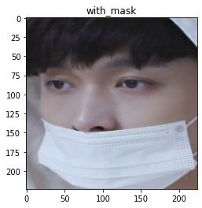

# Project-Mask-Detection
Digital Image Processing

## Model 
- image shape 224 x 224
- mask_detection_model.h5
- MobileNetV2

## train model, predict and face detection
- https://colab.research.google.com/drive/1YlhAtPXkphN7kAU5gZQvG3kFvzExMSFC?usp=sharing

<details>
<summary> Project_Mask_Detection_Train_Model.ipynb </summary>
<br>
# Introduction

Project Mask Detection training model use machine learning

https://medium.com/analytics-vidhya/what-is-a-pipeline-in-machine-learning-how-to-create-one-bda91d0ceaca

dataset - https://www.kaggle.com/omkargurav/face-mask-dataset


```python
# https://medium.com/super-ai-engineer/kora-%E0%B9%80%E0%B8%84%E0%B8%A3%E0%B8%B7%E0%B9%88%E0%B8%AD%E0%B8%87%E0%B8%A1%E0%B8%B7%E0%B8%AD%E0%B8%94%E0%B8%B5-%E0%B9%86-%E0%B8%AA%E0%B8%B3%E0%B8%AB%E0%B8%A3%E0%B8%B1%E0%B8%9A%E0%B8%84%E0%B8%99%E0%B8%A3%E0%B8%B1%E0%B8%81-google-colab-137c193641c0
!pip install -q kora # https://github.com/korakot/kora
```

         |████████████████████████████████| 57 kB 2.5 MB/s 
         |████████████████████████████████| 56 kB 3.4 MB/s 
    [?25h


```python
from kora import kaggle
kaggle.search('omkargurav/face-mask-dataset')
# https://www.kaggle.com/omkargurav/face-mask-dataset
```


<div>
<style scoped>
    .dataframe tbody tr th:only-of-type {
        vertical-align: middle;
    }

    .dataframe tbody tr th {
        vertical-align: top;
    }

    .dataframe thead th {
        text-align: right;
    }
</style>
<table border="1" class="dataframe">
  <thead>
    <tr style="text-align: right;">
      <th></th>
      <th>ref</th>
      <th>title</th>
      <th>size</th>
      <th>lastUpdated</th>
      <th>downloadCount</th>
    </tr>
  </thead>
  <tbody>
    <tr>
      <th>0</th>
      <td>omkargurav/face-mask-dataset</td>
      <td>Face Mask Detection Dataset</td>
      <td>163MB</td>
      <td>2020-07-31 18:34:42</td>
      <td>5054</td>
    </tr>
  </tbody>
</table>
</div>


```python
kaggle.download('omkargurav/face-mask-dataset')
```

    Downloading face-mask-dataset.zip to /content
     99% 162M/163M [00:05<00:00, 37.5MB/s]
    100% 163M/163M [00:05<00:00, 32.1MB/s]
    

# Face mask detection using computer vision


```python
import tensorflow as tf
import numpy as np 
```

### Get data - load dataset

- หน้าที่มีหน้ากาก กับหน้าที่ไม่มีหน้ากาก
- ใช้ภาพทดสอบจาก image_dataset_from_ditectory() ของ keras.preprocssing


```python
!pwd
```

    /content
    


```python
width, height = 224, 224
# mobileNetv2 network
batch_size = 32
data_dir = r"/content/data"
```


```python
training = tf.keras.preprocessing.image_dataset_from_directory(
    data_dir,
    validation_split = 0.3,
    subset = 'training',
    seed = 123,
    image_size = (height, width),
    batch_size = batch_size
)
```

    Found 7553 files belonging to 2 classes.
    Using 5288 files for training.
    


```python
validation = tf.keras.preprocessing.image_dataset_from_directory(
    data_dir,
    validation_split = 0.3,
    subset = 'validation',
    seed = 123,
    image_size = (height, width),
    batch_size = batch_size
)
```

    Found 7553 files belonging to 2 classes.
    Using 2265 files for validation.
    


```python
classes = training.class_names
print(classes)
print(training)
```

    ['with_mask', 'without_mask']
    <BatchDataset shapes: ((None, 224, 224, 3), (None,)), types: (tf.float32, tf.int32)>
    

Check Image in Dataset


```python
import matplotlib.pyplot as plt
for images, labels in training.take(1):
  plt.imshow(images[3].numpy().astype('uint8'))
  plt.title(classes[labels[3]])
```


    

    


```python
for images, labels in training.take(1):
  plt.imshow(images[3].numpy().astype('uint8'))
  plt.title(classes[labels[3]])
```


    

    


```python
for images, labels in training.take(1):
  plt.imshow(images[3].numpy().astype('uint8'))
  plt.title(classes[labels[3]])
```


    

    


## MobileNetv2 model


```python
from tensorflow.keras.applications import MobileNetV2
```


```python
model = MobileNetV2(weights = 'imagenet')
```

    Downloading data from https://storage.googleapis.com/tensorflow/keras-applications/mobilenet_v2/mobilenet_v2_weights_tf_dim_ordering_tf_kernels_1.0_224.h5
    14540800/14536120 [==============================] - 0s 0us/step
    14548992/14536120 [==============================] - 0s 0us/step
    

รันโมเดล (compile)


```python
model.compile(optimizer='adam',
              loss = tf.keras.losses.SparseCategoricalCrossentropy(from_logits=True),
              metrics = ['accuracy'])
```


```python
model.summary()
```

    Model: "mobilenetv2_1.00_224"
    __________________________________________________________________________________________________
    Layer (type)                    Output Shape         Param #     Connected to                     
    ==================================================================================================
    input_1 (InputLayer)            [(None, 224, 224, 3) 0                                            
    __________________________________________________________________________________________________
    Conv1 (Conv2D)                  (None, 112, 112, 32) 864         input_1[0][0]                    
    __________________________________________________________________________________________________
    bn_Conv1 (BatchNormalization)   (None, 112, 112, 32) 128         Conv1[0][0]                      
    __________________________________________________________________________________________________
    Conv1_relu (ReLU)               (None, 112, 112, 32) 0           bn_Conv1[0][0]                   
    __________________________________________________________________________________________________
    expanded_conv_depthwise (Depthw (None, 112, 112, 32) 288         Conv1_relu[0][0]                 
    __________________________________________________________________________________________________
    expanded_conv_depthwise_BN (Bat (None, 112, 112, 32) 128         expanded_conv_depthwise[0][0]    
    __________________________________________________________________________________________________
    expanded_conv_depthwise_relu (R (None, 112, 112, 32) 0           expanded_conv_depthwise_BN[0][0] 
    __________________________________________________________________________________________________
    expanded_conv_project (Conv2D)  (None, 112, 112, 16) 512         expanded_conv_depthwise_relu[0][0
    __________________________________________________________________________________________________
    expanded_conv_project_BN (Batch (None, 112, 112, 16) 64          expanded_conv_project[0][0]      
    __________________________________________________________________________________________________
    block_1_expand (Conv2D)         (None, 112, 112, 96) 1536        expanded_conv_project_BN[0][0]   
    __________________________________________________________________________________________________
    block_1_expand_BN (BatchNormali (None, 112, 112, 96) 384         block_1_expand[0][0]             
    __________________________________________________________________________________________________
    block_1_expand_relu (ReLU)      (None, 112, 112, 96) 0           block_1_expand_BN[0][0]          
    __________________________________________________________________________________________________
    block_1_pad (ZeroPadding2D)     (None, 113, 113, 96) 0           block_1_expand_relu[0][0]        
    __________________________________________________________________________________________________
    block_1_depthwise (DepthwiseCon (None, 56, 56, 96)   864         block_1_pad[0][0]                
    __________________________________________________________________________________________________
    block_1_depthwise_BN (BatchNorm (None, 56, 56, 96)   384         block_1_depthwise[0][0]          
    __________________________________________________________________________________________________
    block_1_depthwise_relu (ReLU)   (None, 56, 56, 96)   0           block_1_depthwise_BN[0][0]       
    __________________________________________________________________________________________________
    block_1_project (Conv2D)        (None, 56, 56, 24)   2304        block_1_depthwise_relu[0][0]     
    __________________________________________________________________________________________________
    block_1_project_BN (BatchNormal (None, 56, 56, 24)   96          block_1_project[0][0]            
    __________________________________________________________________________________________________
    block_2_expand (Conv2D)         (None, 56, 56, 144)  3456        block_1_project_BN[0][0]         
    __________________________________________________________________________________________________
    block_2_expand_BN (BatchNormali (None, 56, 56, 144)  576         block_2_expand[0][0]             
    __________________________________________________________________________________________________
    block_2_expand_relu (ReLU)      (None, 56, 56, 144)  0           block_2_expand_BN[0][0]          
    __________________________________________________________________________________________________
    block_2_depthwise (DepthwiseCon (None, 56, 56, 144)  1296        block_2_expand_relu[0][0]        
    __________________________________________________________________________________________________
    block_2_depthwise_BN (BatchNorm (None, 56, 56, 144)  576         block_2_depthwise[0][0]          
    __________________________________________________________________________________________________
    block_2_depthwise_relu (ReLU)   (None, 56, 56, 144)  0           block_2_depthwise_BN[0][0]       
    __________________________________________________________________________________________________
    block_2_project (Conv2D)        (None, 56, 56, 24)   3456        block_2_depthwise_relu[0][0]     
    __________________________________________________________________________________________________
    block_2_project_BN (BatchNormal (None, 56, 56, 24)   96          block_2_project[0][0]            
    __________________________________________________________________________________________________
    block_2_add (Add)               (None, 56, 56, 24)   0           block_1_project_BN[0][0]         
                                                                     block_2_project_BN[0][0]         
    __________________________________________________________________________________________________
    block_3_expand (Conv2D)         (None, 56, 56, 144)  3456        block_2_add[0][0]                
    __________________________________________________________________________________________________
    block_3_expand_BN (BatchNormali (None, 56, 56, 144)  576         block_3_expand[0][0]             
    __________________________________________________________________________________________________
    block_3_expand_relu (ReLU)      (None, 56, 56, 144)  0           block_3_expand_BN[0][0]          
    __________________________________________________________________________________________________
    block_3_pad (ZeroPadding2D)     (None, 57, 57, 144)  0           block_3_expand_relu[0][0]        
    __________________________________________________________________________________________________
    block_3_depthwise (DepthwiseCon (None, 28, 28, 144)  1296        block_3_pad[0][0]                
    __________________________________________________________________________________________________
    block_3_depthwise_BN (BatchNorm (None, 28, 28, 144)  576         block_3_depthwise[0][0]          
    __________________________________________________________________________________________________
    block_3_depthwise_relu (ReLU)   (None, 28, 28, 144)  0           block_3_depthwise_BN[0][0]       
    __________________________________________________________________________________________________
    block_3_project (Conv2D)        (None, 28, 28, 32)   4608        block_3_depthwise_relu[0][0]     
    __________________________________________________________________________________________________
    block_3_project_BN (BatchNormal (None, 28, 28, 32)   128         block_3_project[0][0]            
    __________________________________________________________________________________________________
    block_4_expand (Conv2D)         (None, 28, 28, 192)  6144        block_3_project_BN[0][0]         
    __________________________________________________________________________________________________
    block_4_expand_BN (BatchNormali (None, 28, 28, 192)  768         block_4_expand[0][0]             
    __________________________________________________________________________________________________
    block_4_expand_relu (ReLU)      (None, 28, 28, 192)  0           block_4_expand_BN[0][0]          
    __________________________________________________________________________________________________
    block_4_depthwise (DepthwiseCon (None, 28, 28, 192)  1728        block_4_expand_relu[0][0]        
    __________________________________________________________________________________________________
    block_4_depthwise_BN (BatchNorm (None, 28, 28, 192)  768         block_4_depthwise[0][0]          
    __________________________________________________________________________________________________
    block_4_depthwise_relu (ReLU)   (None, 28, 28, 192)  0           block_4_depthwise_BN[0][0]       
    __________________________________________________________________________________________________
    block_4_project (Conv2D)        (None, 28, 28, 32)   6144        block_4_depthwise_relu[0][0]     
    __________________________________________________________________________________________________
    block_4_project_BN (BatchNormal (None, 28, 28, 32)   128         block_4_project[0][0]            
    __________________________________________________________________________________________________
    block_4_add (Add)               (None, 28, 28, 32)   0           block_3_project_BN[0][0]         
                                                                     block_4_project_BN[0][0]         
    __________________________________________________________________________________________________
    block_5_expand (Conv2D)         (None, 28, 28, 192)  6144        block_4_add[0][0]                
    __________________________________________________________________________________________________
    block_5_expand_BN (BatchNormali (None, 28, 28, 192)  768         block_5_expand[0][0]             
    __________________________________________________________________________________________________
    block_5_expand_relu (ReLU)      (None, 28, 28, 192)  0           block_5_expand_BN[0][0]          
    __________________________________________________________________________________________________
    block_5_depthwise (DepthwiseCon (None, 28, 28, 192)  1728        block_5_expand_relu[0][0]        
    __________________________________________________________________________________________________
    block_5_depthwise_BN (BatchNorm (None, 28, 28, 192)  768         block_5_depthwise[0][0]          
    __________________________________________________________________________________________________
    block_5_depthwise_relu (ReLU)   (None, 28, 28, 192)  0           block_5_depthwise_BN[0][0]       
    __________________________________________________________________________________________________
    block_5_project (Conv2D)        (None, 28, 28, 32)   6144        block_5_depthwise_relu[0][0]     
    __________________________________________________________________________________________________
    block_5_project_BN (BatchNormal (None, 28, 28, 32)   128         block_5_project[0][0]            
    __________________________________________________________________________________________________
    block_5_add (Add)               (None, 28, 28, 32)   0           block_4_add[0][0]                
                                                                     block_5_project_BN[0][0]         
    __________________________________________________________________________________________________
    block_6_expand (Conv2D)         (None, 28, 28, 192)  6144        block_5_add[0][0]                
    __________________________________________________________________________________________________
    block_6_expand_BN (BatchNormali (None, 28, 28, 192)  768         block_6_expand[0][0]             
    __________________________________________________________________________________________________
    block_6_expand_relu (ReLU)      (None, 28, 28, 192)  0           block_6_expand_BN[0][0]          
    __________________________________________________________________________________________________
    block_6_pad (ZeroPadding2D)     (None, 29, 29, 192)  0           block_6_expand_relu[0][0]        
    __________________________________________________________________________________________________
    block_6_depthwise (DepthwiseCon (None, 14, 14, 192)  1728        block_6_pad[0][0]                
    __________________________________________________________________________________________________
    block_6_depthwise_BN (BatchNorm (None, 14, 14, 192)  768         block_6_depthwise[0][0]          
    __________________________________________________________________________________________________
    block_6_depthwise_relu (ReLU)   (None, 14, 14, 192)  0           block_6_depthwise_BN[0][0]       
    __________________________________________________________________________________________________
    block_6_project (Conv2D)        (None, 14, 14, 64)   12288       block_6_depthwise_relu[0][0]     
    __________________________________________________________________________________________________
    block_6_project_BN (BatchNormal (None, 14, 14, 64)   256         block_6_project[0][0]            
    __________________________________________________________________________________________________
    block_7_expand (Conv2D)         (None, 14, 14, 384)  24576       block_6_project_BN[0][0]         
    __________________________________________________________________________________________________
    block_7_expand_BN (BatchNormali (None, 14, 14, 384)  1536        block_7_expand[0][0]             
    __________________________________________________________________________________________________
    block_7_expand_relu (ReLU)      (None, 14, 14, 384)  0           block_7_expand_BN[0][0]          
    __________________________________________________________________________________________________
    block_7_depthwise (DepthwiseCon (None, 14, 14, 384)  3456        block_7_expand_relu[0][0]        
    __________________________________________________________________________________________________
    block_7_depthwise_BN (BatchNorm (None, 14, 14, 384)  1536        block_7_depthwise[0][0]          
    __________________________________________________________________________________________________
    block_7_depthwise_relu (ReLU)   (None, 14, 14, 384)  0           block_7_depthwise_BN[0][0]       
    __________________________________________________________________________________________________
    block_7_project (Conv2D)        (None, 14, 14, 64)   24576       block_7_depthwise_relu[0][0]     
    __________________________________________________________________________________________________
    block_7_project_BN (BatchNormal (None, 14, 14, 64)   256         block_7_project[0][0]            
    __________________________________________________________________________________________________
    block_7_add (Add)               (None, 14, 14, 64)   0           block_6_project_BN[0][0]         
                                                                     block_7_project_BN[0][0]         
    __________________________________________________________________________________________________
    block_8_expand (Conv2D)         (None, 14, 14, 384)  24576       block_7_add[0][0]                
    __________________________________________________________________________________________________
    block_8_expand_BN (BatchNormali (None, 14, 14, 384)  1536        block_8_expand[0][0]             
    __________________________________________________________________________________________________
    block_8_expand_relu (ReLU)      (None, 14, 14, 384)  0           block_8_expand_BN[0][0]          
    __________________________________________________________________________________________________
    block_8_depthwise (DepthwiseCon (None, 14, 14, 384)  3456        block_8_expand_relu[0][0]        
    __________________________________________________________________________________________________
    block_8_depthwise_BN (BatchNorm (None, 14, 14, 384)  1536        block_8_depthwise[0][0]          
    __________________________________________________________________________________________________
    block_8_depthwise_relu (ReLU)   (None, 14, 14, 384)  0           block_8_depthwise_BN[0][0]       
    __________________________________________________________________________________________________
    block_8_project (Conv2D)        (None, 14, 14, 64)   24576       block_8_depthwise_relu[0][0]     
    __________________________________________________________________________________________________
    block_8_project_BN (BatchNormal (None, 14, 14, 64)   256         block_8_project[0][0]            
    __________________________________________________________________________________________________
    block_8_add (Add)               (None, 14, 14, 64)   0           block_7_add[0][0]                
                                                                     block_8_project_BN[0][0]         
    __________________________________________________________________________________________________
    block_9_expand (Conv2D)         (None, 14, 14, 384)  24576       block_8_add[0][0]                
    __________________________________________________________________________________________________
    block_9_expand_BN (BatchNormali (None, 14, 14, 384)  1536        block_9_expand[0][0]             
    __________________________________________________________________________________________________
    block_9_expand_relu (ReLU)      (None, 14, 14, 384)  0           block_9_expand_BN[0][0]          
    __________________________________________________________________________________________________
    block_9_depthwise (DepthwiseCon (None, 14, 14, 384)  3456        block_9_expand_relu[0][0]        
    __________________________________________________________________________________________________
    block_9_depthwise_BN (BatchNorm (None, 14, 14, 384)  1536        block_9_depthwise[0][0]          
    __________________________________________________________________________________________________
    block_9_depthwise_relu (ReLU)   (None, 14, 14, 384)  0           block_9_depthwise_BN[0][0]       
    __________________________________________________________________________________________________
    block_9_project (Conv2D)        (None, 14, 14, 64)   24576       block_9_depthwise_relu[0][0]     
    __________________________________________________________________________________________________
    block_9_project_BN (BatchNormal (None, 14, 14, 64)   256         block_9_project[0][0]            
    __________________________________________________________________________________________________
    block_9_add (Add)               (None, 14, 14, 64)   0           block_8_add[0][0]                
                                                                     block_9_project_BN[0][0]         
    __________________________________________________________________________________________________
    block_10_expand (Conv2D)        (None, 14, 14, 384)  24576       block_9_add[0][0]                
    __________________________________________________________________________________________________
    block_10_expand_BN (BatchNormal (None, 14, 14, 384)  1536        block_10_expand[0][0]            
    __________________________________________________________________________________________________
    block_10_expand_relu (ReLU)     (None, 14, 14, 384)  0           block_10_expand_BN[0][0]         
    __________________________________________________________________________________________________
    block_10_depthwise (DepthwiseCo (None, 14, 14, 384)  3456        block_10_expand_relu[0][0]       
    __________________________________________________________________________________________________
    block_10_depthwise_BN (BatchNor (None, 14, 14, 384)  1536        block_10_depthwise[0][0]         
    __________________________________________________________________________________________________
    block_10_depthwise_relu (ReLU)  (None, 14, 14, 384)  0           block_10_depthwise_BN[0][0]      
    __________________________________________________________________________________________________
    block_10_project (Conv2D)       (None, 14, 14, 96)   36864       block_10_depthwise_relu[0][0]    
    __________________________________________________________________________________________________
    block_10_project_BN (BatchNorma (None, 14, 14, 96)   384         block_10_project[0][0]           
    __________________________________________________________________________________________________
    block_11_expand (Conv2D)        (None, 14, 14, 576)  55296       block_10_project_BN[0][0]        
    __________________________________________________________________________________________________
    block_11_expand_BN (BatchNormal (None, 14, 14, 576)  2304        block_11_expand[0][0]            
    __________________________________________________________________________________________________
    block_11_expand_relu (ReLU)     (None, 14, 14, 576)  0           block_11_expand_BN[0][0]         
    __________________________________________________________________________________________________
    block_11_depthwise (DepthwiseCo (None, 14, 14, 576)  5184        block_11_expand_relu[0][0]       
    __________________________________________________________________________________________________
    block_11_depthwise_BN (BatchNor (None, 14, 14, 576)  2304        block_11_depthwise[0][0]         
    __________________________________________________________________________________________________
    block_11_depthwise_relu (ReLU)  (None, 14, 14, 576)  0           block_11_depthwise_BN[0][0]      
    __________________________________________________________________________________________________
    block_11_project (Conv2D)       (None, 14, 14, 96)   55296       block_11_depthwise_relu[0][0]    
    __________________________________________________________________________________________________
    block_11_project_BN (BatchNorma (None, 14, 14, 96)   384         block_11_project[0][0]           
    __________________________________________________________________________________________________
    block_11_add (Add)              (None, 14, 14, 96)   0           block_10_project_BN[0][0]        
                                                                     block_11_project_BN[0][0]        
    __________________________________________________________________________________________________
    block_12_expand (Conv2D)        (None, 14, 14, 576)  55296       block_11_add[0][0]               
    __________________________________________________________________________________________________
    block_12_expand_BN (BatchNormal (None, 14, 14, 576)  2304        block_12_expand[0][0]            
    __________________________________________________________________________________________________
    block_12_expand_relu (ReLU)     (None, 14, 14, 576)  0           block_12_expand_BN[0][0]         
    __________________________________________________________________________________________________
    block_12_depthwise (DepthwiseCo (None, 14, 14, 576)  5184        block_12_expand_relu[0][0]       
    __________________________________________________________________________________________________
    block_12_depthwise_BN (BatchNor (None, 14, 14, 576)  2304        block_12_depthwise[0][0]         
    __________________________________________________________________________________________________
    block_12_depthwise_relu (ReLU)  (None, 14, 14, 576)  0           block_12_depthwise_BN[0][0]      
    __________________________________________________________________________________________________
    block_12_project (Conv2D)       (None, 14, 14, 96)   55296       block_12_depthwise_relu[0][0]    
    __________________________________________________________________________________________________
    block_12_project_BN (BatchNorma (None, 14, 14, 96)   384         block_12_project[0][0]           
    __________________________________________________________________________________________________
    block_12_add (Add)              (None, 14, 14, 96)   0           block_11_add[0][0]               
                                                                     block_12_project_BN[0][0]        
    __________________________________________________________________________________________________
    block_13_expand (Conv2D)        (None, 14, 14, 576)  55296       block_12_add[0][0]               
    __________________________________________________________________________________________________
    block_13_expand_BN (BatchNormal (None, 14, 14, 576)  2304        block_13_expand[0][0]            
    __________________________________________________________________________________________________
    block_13_expand_relu (ReLU)     (None, 14, 14, 576)  0           block_13_expand_BN[0][0]         
    __________________________________________________________________________________________________
    block_13_pad (ZeroPadding2D)    (None, 15, 15, 576)  0           block_13_expand_relu[0][0]       
    __________________________________________________________________________________________________
    block_13_depthwise (DepthwiseCo (None, 7, 7, 576)    5184        block_13_pad[0][0]               
    __________________________________________________________________________________________________
    block_13_depthwise_BN (BatchNor (None, 7, 7, 576)    2304        block_13_depthwise[0][0]         
    __________________________________________________________________________________________________
    block_13_depthwise_relu (ReLU)  (None, 7, 7, 576)    0           block_13_depthwise_BN[0][0]      
    __________________________________________________________________________________________________
    block_13_project (Conv2D)       (None, 7, 7, 160)    92160       block_13_depthwise_relu[0][0]    
    __________________________________________________________________________________________________
    block_13_project_BN (BatchNorma (None, 7, 7, 160)    640         block_13_project[0][0]           
    __________________________________________________________________________________________________
    block_14_expand (Conv2D)        (None, 7, 7, 960)    153600      block_13_project_BN[0][0]        
    __________________________________________________________________________________________________
    block_14_expand_BN (BatchNormal (None, 7, 7, 960)    3840        block_14_expand[0][0]            
    __________________________________________________________________________________________________
    block_14_expand_relu (ReLU)     (None, 7, 7, 960)    0           block_14_expand_BN[0][0]         
    __________________________________________________________________________________________________
    block_14_depthwise (DepthwiseCo (None, 7, 7, 960)    8640        block_14_expand_relu[0][0]       
    __________________________________________________________________________________________________
    block_14_depthwise_BN (BatchNor (None, 7, 7, 960)    3840        block_14_depthwise[0][0]         
    __________________________________________________________________________________________________
    block_14_depthwise_relu (ReLU)  (None, 7, 7, 960)    0           block_14_depthwise_BN[0][0]      
    __________________________________________________________________________________________________
    block_14_project (Conv2D)       (None, 7, 7, 160)    153600      block_14_depthwise_relu[0][0]    
    __________________________________________________________________________________________________
    block_14_project_BN (BatchNorma (None, 7, 7, 160)    640         block_14_project[0][0]           
    __________________________________________________________________________________________________
    block_14_add (Add)              (None, 7, 7, 160)    0           block_13_project_BN[0][0]        
                                                                     block_14_project_BN[0][0]        
    __________________________________________________________________________________________________
    block_15_expand (Conv2D)        (None, 7, 7, 960)    153600      block_14_add[0][0]               
    __________________________________________________________________________________________________
    block_15_expand_BN (BatchNormal (None, 7, 7, 960)    3840        block_15_expand[0][0]            
    __________________________________________________________________________________________________
    block_15_expand_relu (ReLU)     (None, 7, 7, 960)    0           block_15_expand_BN[0][0]         
    __________________________________________________________________________________________________
    block_15_depthwise (DepthwiseCo (None, 7, 7, 960)    8640        block_15_expand_relu[0][0]       
    __________________________________________________________________________________________________
    block_15_depthwise_BN (BatchNor (None, 7, 7, 960)    3840        block_15_depthwise[0][0]         
    __________________________________________________________________________________________________
    block_15_depthwise_relu (ReLU)  (None, 7, 7, 960)    0           block_15_depthwise_BN[0][0]      
    __________________________________________________________________________________________________
    block_15_project (Conv2D)       (None, 7, 7, 160)    153600      block_15_depthwise_relu[0][0]    
    __________________________________________________________________________________________________
    block_15_project_BN (BatchNorma (None, 7, 7, 160)    640         block_15_project[0][0]           
    __________________________________________________________________________________________________
    block_15_add (Add)              (None, 7, 7, 160)    0           block_14_add[0][0]               
                                                                     block_15_project_BN[0][0]        
    __________________________________________________________________________________________________
    block_16_expand (Conv2D)        (None, 7, 7, 960)    153600      block_15_add[0][0]               
    __________________________________________________________________________________________________
    block_16_expand_BN (BatchNormal (None, 7, 7, 960)    3840        block_16_expand[0][0]            
    __________________________________________________________________________________________________
    block_16_expand_relu (ReLU)     (None, 7, 7, 960)    0           block_16_expand_BN[0][0]         
    __________________________________________________________________________________________________
    block_16_depthwise (DepthwiseCo (None, 7, 7, 960)    8640        block_16_expand_relu[0][0]       
    __________________________________________________________________________________________________
    block_16_depthwise_BN (BatchNor (None, 7, 7, 960)    3840        block_16_depthwise[0][0]         
    __________________________________________________________________________________________________
    block_16_depthwise_relu (ReLU)  (None, 7, 7, 960)    0           block_16_depthwise_BN[0][0]      
    __________________________________________________________________________________________________
    block_16_project (Conv2D)       (None, 7, 7, 320)    307200      block_16_depthwise_relu[0][0]    
    __________________________________________________________________________________________________
    block_16_project_BN (BatchNorma (None, 7, 7, 320)    1280        block_16_project[0][0]           
    __________________________________________________________________________________________________
    Conv_1 (Conv2D)                 (None, 7, 7, 1280)   409600      block_16_project_BN[0][0]        
    __________________________________________________________________________________________________
    Conv_1_bn (BatchNormalization)  (None, 7, 7, 1280)   5120        Conv_1[0][0]                     
    __________________________________________________________________________________________________
    out_relu (ReLU)                 (None, 7, 7, 1280)   0           Conv_1_bn[0][0]                  
    __________________________________________________________________________________________________
    global_average_pooling2d (Globa (None, 1280)         0           out_relu[0][0]                   
    __________________________________________________________________________________________________
    predictions (Dense)             (None, 1000)         1281000     global_average_pooling2d[0][0]   
    ==================================================================================================
    Total params: 3,538,984
    Trainable params: 3,504,872
    Non-trainable params: 34,112
    __________________________________________________________________________________________________
    

### Training the model


https://keras.rstudio.com/reference/fit.html#arguments

validation_data	
Data on which to evaluate the loss and any model metrics at the end of each epoch. The model will not be trained on this data. This could be a list (x_val, y_val) or a list (x_val, y_val, val_sample_weights). validation_data will override validation_split.


- หมายถึง ข้อมูลการตรวจสอบ ประเมินค่า loss และ model metrics เมื่อจบ epoch


epochs
Number of epochs to train the model. Note that in conjunction with initial_epoch, epochs is to be understood as "final epoch". The model is not trained for a number of iterations given by epochs, but merely until the epoch of index epochs is reached.

- epochs	คือ จำนวนครั้งในการฝึกโมเดล


```python
# train 3 ครั้ง
face_mask_detection = model.fit(training, validation_data= validation, epochs=3)
```

    Epoch 1/3
    

    /usr/local/lib/python3.7/dist-packages/keras/backend.py:4907: UserWarning: "`sparse_categorical_crossentropy` received `from_logits=True`, but the `output` argument was produced by a sigmoid or softmax activation and thus does not represent logits. Was this intended?"
      '"`sparse_categorical_crossentropy` received `from_logits=True`, but '
    

    166/166 [==============================] - 104s 401ms/step - loss: 0.1834 - accuracy: 0.9635 - val_loss: 16.2736 - val_accuracy: 0.5055
    Epoch 2/3
    166/166 [==============================] - 65s 388ms/step - loss: 0.0259 - accuracy: 0.9915 - val_loss: 3.1604 - val_accuracy: 0.7377
    Epoch 3/3
    166/166 [==============================] - 65s 387ms/step - loss: 0.0243 - accuracy: 0.9936 - val_loss: 0.9901 - val_accuracy: 0.9002
    

- ETA คือเวลาที่คาดว่า กำลังจะเสร็จ
- loss คือ ค่าความสูญเสีย (ผิดพลาด) 
- accuracy คือค่าความถูกต้อง

### Predicting


```python
# for upload image
from google.colab import files
uploaded = files.upload()
```


<input type="file" id="files-bae91907-4253-4a53-8e38-8fd855ffdcec" name="files[]" multiple disabled
   style="border:none" />
<output id="result-bae91907-4253-4a53-8e38-8fd855ffdcec">
 Upload widget is only available when the cell has been executed in the
 current browser session. Please rerun this cell to enable.
 </output>
 <script src="/nbextensions/google.colab/files.js"></script> 


    Saving testimg.jpg to testimg.jpg
    


```python
# โหลดภาพมา
# image = tf.keras.preprocessing.image.load_img(image_path)
img = tf.keras.preprocessing.image.load_img('testimg.jpg', target_size=(height, width))

# แปลงเป็น array
image_array = tf.keras.preprocessing.image.img_to_array(img)
# ขยายมิติภาพเพื่อให้ fit กับ model
image_array = tf.expand_dims(image_array, 0)

# เช็ค shape ภาพ
image_array.shape
```


    TensorShape([1, 224, 224, 3])


```python
import random 
predictions = model.predict(image_array)
score = tf.nn.softmax(predictions[0])

for i in range(15):
  ran = random.randint(1, len(score))
  res = score[ran]*100000
  print(res)
print(type(res))

```

    tf.Tensor(99.828476, shape=(), dtype=float32)
    tf.Tensor(99.828476, shape=(), dtype=float32)
    tf.Tensor(99.828476, shape=(), dtype=float32)
    tf.Tensor(99.828476, shape=(), dtype=float32)
    tf.Tensor(99.828476, shape=(), dtype=float32)
    tf.Tensor(99.828476, shape=(), dtype=float32)
    tf.Tensor(99.828476, shape=(), dtype=float32)
    tf.Tensor(99.828476, shape=(), dtype=float32)
    tf.Tensor(99.828476, shape=(), dtype=float32)
    tf.Tensor(99.828476, shape=(), dtype=float32)
    tf.Tensor(99.828476, shape=(), dtype=float32)
    tf.Tensor(99.828476, shape=(), dtype=float32)
    tf.Tensor(99.828476, shape=(), dtype=float32)
    tf.Tensor(99.828476, shape=(), dtype=float32)
    tf.Tensor(99.828476, shape=(), dtype=float32)
    <class 'tensorflow.python.framework.ops.EagerTensor'>
    

*Save the model*


```python
model.save('mask_detection_model', save_format='h5')
```

    /usr/local/lib/python3.7/dist-packages/keras/utils/generic_utils.py:497: CustomMaskWarning: Custom mask layers require a config and must override get_config. When loading, the custom mask layer must be passed to the custom_objects argument.
      category=CustomMaskWarning)
    

# Face Detection Mask

## Introduction


```python
# library สำหรับใช่ videocapture
from IPython.display import display, Javascript
from google.colab.output import eval_js
from base64 import b64decode, b64encode
import numpy as np
from PIL import Image
import io
```


```python
# โหลด haarcascade เพื่อช่วยในการตรวจจับใบหน้า
!wget https://raw.githubusercontent.com/opencv/opencv/master/data/haarcascades/haarcascade_frontalface_default.xml
# โหลด model เพื่อทำการตรวจจับหน้ากาก
!wget https://raw.githubusercontent.com/lacakp/Project-Mask-Detection/main/mask_detection_model
```

## Videocapture


```python
## โค้ด videocapture 
# reference 
# - AI บ้าน บ้าน (รศ.ดร.ปริญญา สงวนสัตย์)
# - https://www.youtube.com/watch?v=1VziTgVt4GQ&t=11s
# - https://colab.research.google.com/drive/1v4zM9Gcxt6r5pHGN8HS6CYsLTt1VoZsG

def VideoCapture(): # ฟังก์ชันสำหรับเรียกใช้ VideoCapture()
  js = Javascript('''
    async function create(){
      div = document.createElement('div');
      document.body.appendChild(div);

      video = document.createElement('video');
      video.setAttribute('playsinline', '');

      div.appendChild(video);

      stream = await navigator.mediaDevices.getUserMedia({video: {facingMode: "environment"}});
      video.srcObject = stream;

      await video.play();

      canvas =  document.createElement('canvas');
      canvas.width = video.videoWidth;
      canvas.height = video.videoHeight;
      canvas.getContext('2d').drawImage(video, 0, 0);

      div_out = document.createElement('div');
      document.body.appendChild(div_out);
      img = document.createElement('img');
      div_out.appendChild(img);
    }

    async function capture(){
        return await new Promise(function(resolve, reject){
            pendingResolve = resolve;
            canvas.getContext('2d').drawImage(video, 0, 0);
            result = canvas.toDataURL('image/jpeg', 0.8);
            pendingResolve(result);
        })
    }

    function showimg(imgb64){
        img.src = "data:image/jpg;base64," + imgb64;
    }

  ''')
  display(js)

def byte2image(byte): # ฟังก์ชันสำหรับแปลงข้อมูล byte เป็นรูปภาพ
  jpeg = b64decode(byte.split(',')[1])
  im = Image.open(io.BytesIO(jpeg))
  return np.array(im)

def image2byte(image): # ฟังก์ชันสำหรับแปลงข้อมูล ภาพ เป็น byte
  image = Image.fromarray(image)
  buffer = io.BytesIO()
  image.save(buffer, 'jpeg')
  buffer.seek(0)
  x = b64encode(buffer.read()).decode('utf-8')
  return x

```

## Pre-processing


```python
# Pre-processing
import cv2     # OpenCV provides a real-time optimized Computer Vision library
import numpy as np # NumPy เป็นไลบรารี่ที่เพิ่มการรองรับอาร์เรย์และเมทริกซ์ขนาดใหญ่หลายมิติ พร้อมด้วยคอลเลกชั่นฟังก์ชันทางคณิตศาสตร์ระดับสูงจำนวนมาก
from keras.models import load_model # keras.models เพื่อทำการโหลดโมเดลจากไฟล์
import tensorflow as tf             # TensorFlow เป็นไลบรารีซอฟต์แวร์โอเพ่นซอร์สฟรีสำหรับการเรียนรู้ของเครื่องและปัญญาประดิษฐ์
from google.colab.patches import cv2_imshow # ใช้ cv_imshow สำหรับโชว์ภาพบนโคแลป
model = load_model("./mask_detection_model") # ทำการโหลดโมเดล
face_detector = cv2.CascadeClassifier('haarcascade_frontalface_default.xml') 
# ใช้ haarcascade (การตรวจจับวัตถุโดยใช้ตัวแยกประเภทการเรียงซ้อนตามฟีเจอร์ของ Haar เป็นวิธีการตรวจจับวัตถุที่มีประสิทธิภาพซึ่งเสนอโดย Paul Viola และ Michael Jones)
```

## Processing | Post-Processing


```python
# processing
# กด CTRL + M + L เพื่อโชว์ จำนวนบรรทัดใน ceil (ซึ่งเป็น คีย์ลัดของ colab)
# model shape  shape=(None, 224, 224, 3) (รูปร่างของโมเดล ซึ่งโมเดลถูกเทรนด้วยภาพ ขนาด 224x224)

VideoCapture()  # เรียกใช้ฟังก์ชัน VideoCapture() เพื่อทำการเรียกใช้กล้อง ซึ่งโค้ดส่วนนี้คือ Java Script เพื่อทำให้ใช้งานกล้องใน colab ได้ โดย รศ.ดร.ปริญญา สงวนสัตย์
eval_js('create()') 
while True: # เริ่มต้นการ ตรวจจับใบหน้าและเช็คว่ามีแมสก์หรือไม่
    byte = eval_js('capture()')  # เป็นข้อมูล byte ที่ได้จากการอ่านภาพจากกล้อง
    frame = byte2image(byte) # แปลง ข้อมูล byte เป็น ภาพ ด้วยฟังก์ชัน byte2image()
    frame = cv2.flip(frame,1,1) # สลับเพื่อให้ไม่เหมือนกระจก
    new_img = cv2.resize(frame, (frame.shape[1] // 1, frame.shape[0] // 1)) # resize ขนาดภาพเพื่อให้ง่ายต่อการตรวจจับ

    faces = face_detector.detectMultiScale(new_img) # สำหรับตรวจจับใบหน้า โดย 
    for x, y, w, h in faces: # วนซ้ำพิกัดบนใบหน้า
      face_img = new_img[y:x+h, x:x+w] # ดึงพิกัดใบหน้า
      resized = cv2.resize(face_img, (224, 224)) # ให้ภาพใบหน้า fit กับโมเดล (224,224)
      img_array = tf.keras.preprocessing.image.img_to_array(resized) # แปลงใบหน้าเป็น array
      img_array = tf.expand_dims(img_array, 0) #ขยายมิติภาพฟิตกับโมดล
      predictions = model.predict(img_array) # ทำนายบน ROI (Region of Interest)
      score = tf.nn.softmax(predictions[0]) # ผลลัพธ์
      label = np.argmax(score) # หาค่าสูงสุด

      # Post-Processing
 
      if label == 0: # ถ้าค่าที่ได้ เป็น 0 
        cv2.rectangle(new_img, (x, y), (x+w, y+h), (0, 255, 0), 2)  # วาดสี่เหลี่ยมรอบใบหน้า
        cv2.putText(new_img, "mask", (x, y), cv2.FONT_HERSHEY_SIMPLEX, 0.8, (0, 255, 0), 2) # แสดงข้อความ "mask"
      elif label == 1:
        cv2.rectangle(new_img, (x, y), (x+w, y+h), (0, 255, 0), 2) # วาดสี่เหลี่ยมรอบใบหน้า
        cv2.putText(new_img, "No mask", (x, y), cv2.FONT_HERSHEY_SIMPLEX, 0.8, (0, 255, 0), 2) # แสดงข้อความ "No mask"
      else:
        None
      # pass
      # แสดงผลหลังจากทำนาย
      new_img = cv2.cvtColor(new_img, cv2.COLOR_BGR2RGB) # ทำการแปลงภาพจาก ปริภูมิ BGR เป็น RGB
      cv2_imshow(new_img) # แสดงภาพ
      print(np.argmax(score), 100 * np.max(score)) # แสดงค่าความถูกต้อง

    eval_js('showimg("{}")'.format(image2byte(frame))) # แสดงเฟรมกล้อง
```


```python

```

</details> 

        
-----------------------------------------------------------------------------------------------------------

## face detection use mask_model
- https://colab.research.google.com/drive/1HFf9aDaNuNgP9gF6jUPuy6BmVA_0FeUT?usp=sharing

<details>
<summary>Face_Detection_Mask.jpynb</summary>
<br>
# Face Detection Mask

## Introduction


```python
# library สำหรับใช่ videocapture
from IPython.display import display, Javascript
from google.colab.output import eval_js
from base64 import b64decode, b64encode
import numpy as np
from PIL import Image
import io
```


```python
# โหลด haarcascade เพื่อช่วยในการตรวจจับใบหน้า
!wget https://raw.githubusercontent.com/opencv/opencv/master/data/haarcascades/haarcascade_frontalface_default.xml
# โหลด model เพื่อทำการตรวจจับหน้ากาก
!wget https://raw.githubusercontent.com/lacakp/Project-Mask-Detection/main/mask_detection_model
```

    --2021-09-25 08:25:17--  https://raw.githubusercontent.com/opencv/opencv/master/data/haarcascades/haarcascade_frontalface_default.xml
    Resolving raw.githubusercontent.com (raw.githubusercontent.com)... 185.199.108.133, 185.199.109.133, 185.199.110.133, ...
    Connecting to raw.githubusercontent.com (raw.githubusercontent.com)|185.199.108.133|:443... connected.
    HTTP request sent, awaiting response... 200 OK
    Length: 930127 (908K) [text/plain]
    Saving to: ‘haarcascade_frontalface_default.xml’
    
    haarcascade_frontal 100%[===================>] 908.33K  --.-KB/s    in 0.05s   
    
    2021-09-25 08:25:18 (18.1 MB/s) - ‘haarcascade_frontalface_default.xml’ saved [930127/930127]
    
    --2021-09-25 08:25:18--  https://raw.githubusercontent.com/lacakp/Project-Mask-Detection/main/mask_detection_model
    Resolving raw.githubusercontent.com (raw.githubusercontent.com)... 185.199.108.133, 185.199.109.133, 185.199.110.133, ...
    Connecting to raw.githubusercontent.com (raw.githubusercontent.com)|185.199.108.133|:443... connected.
    HTTP request sent, awaiting response... 200 OK
    Length: 43065952 (41M) [application/octet-stream]
    Saving to: ‘mask_detection_model’
    
    mask_detection_mode 100%[===================>]  41.07M   188MB/s    in 0.2s    
    
    2021-09-25 08:25:19 (188 MB/s) - ‘mask_detection_model’ saved [43065952/43065952]
    
    

## Videocapture


```python
## โค้ด videocapture 
# reference 
# - AI บ้าน บ้าน (รศ.ดร.ปริญญา สงวนสัตย์)
# - https://www.youtube.com/watch?v=1VziTgVt4GQ&t=11s
# - https://colab.research.google.com/drive/1v4zM9Gcxt6r5pHGN8HS6CYsLTt1VoZsG

def VideoCapture(): # ฟังก์ชันสำหรับเรียกใช้ VideoCapture()
  js = Javascript('''
    async function create(){
      div = document.createElement('div');
      document.body.appendChild(div);

      video = document.createElement('video');
      video.setAttribute('playsinline', '');

      div.appendChild(video);

      stream = await navigator.mediaDevices.getUserMedia({video: {facingMode: "environment"}});
      video.srcObject = stream;

      await video.play();

      canvas =  document.createElement('canvas');
      canvas.width = video.videoWidth;
      canvas.height = video.videoHeight;
      canvas.getContext('2d').drawImage(video, 0, 0);

      div_out = document.createElement('div');
      document.body.appendChild(div_out);
      img = document.createElement('img');
      div_out.appendChild(img);
    }

    async function capture(){
        return await new Promise(function(resolve, reject){
            pendingResolve = resolve;
            canvas.getContext('2d').drawImage(video, 0, 0);
            result = canvas.toDataURL('image/jpeg', 0.8);
            pendingResolve(result);
        })
    }

    function showimg(imgb64){
        img.src = "data:image/jpg;base64," + imgb64;
    }

  ''')
  display(js)

def byte2image(byte): # ฟังก์ชันสำหรับแปลงข้อมูล byte เป็นรูปภาพ
  jpeg = b64decode(byte.split(',')[1])
  im = Image.open(io.BytesIO(jpeg))
  return np.array(im)

def image2byte(image): # ฟังก์ชันสำหรับแปลงข้อมูล ภาพ เป็น byte
  image = Image.fromarray(image)
  buffer = io.BytesIO()
  image.save(buffer, 'jpeg')
  buffer.seek(0)
  x = b64encode(buffer.read()).decode('utf-8')
  return x

```

## Pre-processing


```python
# Pre-processing
import cv2     # OpenCV provides a real-time optimized Computer Vision library
import numpy as np # NumPy เป็นไลบรารี่ที่เพิ่มการรองรับอาร์เรย์และเมทริกซ์ขนาดใหญ่หลายมิติ พร้อมด้วยคอลเลกชั่นฟังก์ชันทางคณิตศาสตร์ระดับสูงจำนวนมาก
from keras.models import load_model # keras.models เพื่อทำการโหลดโมเดลจากไฟล์
import tensorflow as tf             # TensorFlow เป็นไลบรารีซอฟต์แวร์โอเพ่นซอร์สฟรีสำหรับการเรียนรู้ของเครื่องและปัญญาประดิษฐ์
from google.colab.patches import cv2_imshow # ใช้ cv_imshow สำหรับโชว์ภาพบนโคแลป
model = load_model("./mask_detection_model") # ทำการโหลดโมเดล
face_detector = cv2.CascadeClassifier('haarcascade_frontalface_default.xml') 
# ใช้ haarcascade (การตรวจจับวัตถุโดยใช้ตัวแยกประเภทการเรียงซ้อนตามฟีเจอร์ของ Haar เป็นวิธีการตรวจจับวัตถุที่มีประสิทธิภาพซึ่งเสนอโดย Paul Viola และ Michael Jones)
```

## Processing | Post-Processing


```python
# processing
# กด CTRL + M + L เพื่อโชว์ จำนวนบรรทัดใน ceil (ซึ่งเป็น คีย์ลัดของ colab)
# model shape  shape=(None, 224, 224, 3) (รูปร่างของโมเดล ซึ่งโมเดลถูกเทรนด้วยภาพ ขนาด 224x224)

VideoCapture()  # เรียกใช้ฟังก์ชัน VideoCapture() เพื่อทำการเรียกใช้กล้อง ซึ่งโค้ดส่วนนี้คือ Java Script เพื่อทำให้ใช้งานกล้องใน colab ได้ โดย รศ.ดร.ปริญญา สงวนสัตย์
eval_js('create()') 
while True: # เริ่มต้นการ ตรวจจับใบหน้าและเช็คว่ามีแมสก์หรือไม่
    byte = eval_js('capture()')  # เป็นข้อมูล byte ที่ได้จากการอ่านภาพจากกล้อง
    frame = byte2image(byte) # แปลง ข้อมูล byte เป็น ภาพ ด้วยฟังก์ชัน byte2image()
    frame = cv2.flip(frame,1,1) # สลับเพื่อให้ไม่เหมือนกระจก
    new_img = cv2.resize(frame, (frame.shape[1] // 1, frame.shape[0] // 1)) # resize ขนาดภาพเพื่อให้ง่ายต่อการตรวจจับ

    faces = face_detector.detectMultiScale(new_img) # สำหรับตรวจจับใบหน้า โดย 
    for x, y, w, h in faces: # วนซ้ำพิกัดบนใบหน้า
      face_img = new_img[y:x+h, x:x+w] # ดึงพิกัดใบหน้า
      resized = cv2.resize(face_img, (224, 224)) # ให้ภาพใบหน้า fit กับโมเดล (224,224)
      img_array = tf.keras.preprocessing.image.img_to_array(resized) # แปลงใบหน้าเป็น array
      img_array = tf.expand_dims(img_array, 0) #ขยายมิติภาพฟิตกับโมดล
      predictions = model.predict(img_array) # ทำนายบน ROI (Region of Interest)
      score = tf.nn.softmax(predictions[0]) # ผลลัพธ์
      label = np.argmax(score) # หาค่าสูงสุด

      # Post-Processing
 
      if label == 0: # ถ้าค่าที่ได้ เป็น 0 
        cv2.rectangle(new_img, (x, y), (x+w, y+h), (0, 255, 0), 2)  # วาดสี่เหลี่ยมรอบใบหน้า
        cv2.putText(new_img, "mask", (x, y), cv2.FONT_HERSHEY_SIMPLEX, 0.8, (0, 255, 0), 2) # แสดงข้อความ "mask"
      elif label == 1:
        cv2.rectangle(new_img, (x, y), (x+w, y+h), (0, 255, 0), 2) # วาดสี่เหลี่ยมรอบใบหน้า
        cv2.putText(new_img, "No mask", (x, y), cv2.FONT_HERSHEY_SIMPLEX, 0.8, (0, 255, 0), 2) # แสดงข้อความ "No mask"
      else:
        None
      # pass
      # แสดงผลหลังจากทำนาย
      new_img = cv2.cvtColor(new_img, cv2.COLOR_BGR2RGB) # ทำการแปลงภาพจาก ปริภูมิ BGR เป็น RGB
      cv2_imshow(new_img) # แสดงภาพ
      print(np.argmax(score), 100 * np.max(score)) # แสดงค่าความถูกต้อง

    eval_js('showimg("{}")'.format(image2byte(frame))) # แสดงเฟรมกล้อง
```


```python

```
</details>

        
 
 
